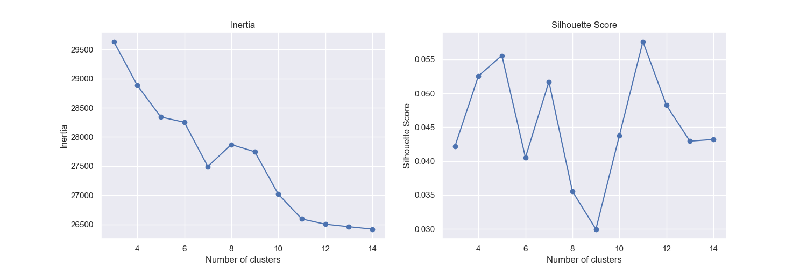

# Patient-notes-clustering

## Overview

<p>Patient Notes Clustering project is about using the text written by numerous Physicians about 10 different patients. I turned this into an unsupervised machine learning by only considering the physician notes. This natural language processing (NLP) endeavor aims to uncover meaningful patterns and groupings within a dataset of physician notes. By leveraging advanced NLP techniques, we can gain valuable insights into the underlying structure of the data, potentially revealing trends and associations.</p>

## About Dataset

<p>The dataset was given as a part of my NLP coursework. The data has 3 columns out of which two prominent features are `case_num` (indicating patient - has 10 unique values representing 10 different patients) and `pn_history` (notes written by physician).</p>

<p>The `case_num` is used to compare the clustering plot results. On the `pn_history`, we apply Natural language processing techniques and Unsupervised Machine learning techniques to cluster the `pn_history`.</p>

## IDE and Environment

- Programming Language : Python
- IDE : Jupyter Notebooks
- Environment : environment.yml file included

## Data Cleaning and Data preprocessing

<p>There are no missing values in the data. As a part of data preprocessing, I first defined list of contractions and medical abbreviations to be replaced. Later, using regular expressions, I have converted the notes text to lower case, removed number, punctuations and special characters and stop words.</p>
<p>To reduce word to its root form, I compared the results of Lemmatizer and Stemming and decided to use Lemmatization. All these processes are implemented through a function called `preprocess_text`. Later, I have created two new columns, one for original note length and the other for processed text length for visualizations.</p>

## Visualizations

- The following histogram shows us the distribution of note length before and after preprocessing.


- Since we have 10 unique patients, I made the following plot to show the most frequent words in their combined physician notes. We can see that words like `year` are frequent in all the cases.


- The following is a bar plot of top 20 words in all the notes combined irrespective of patient followed

  

## Using TFIDF

<p>I have defined my X (notes) and y (case_num - only to be used for verification). Using my X, I have build a Document Term Matrix (DTM using TFIDF vectorizor. However, instead of using every word occurance, I have filtered the words (which are features in DTM) using `min_df` and `max_df` parameters to remove most and least frequent words. The resulting DTM has 2478 features (prominent words).</p>

## Dimensionality Reduction

To tackle the curse of dimensionality are make it visualisable, I have tried different dimensionality reduction Techniques like `TruncatedSVD`, `UMAP` and `T-SNE`. The results of UMAP and T-SNE can easily be visualized in 2-Dimensions. 

- UMAP (2 Components):

 

- T-SNE (2 Components):

 


## Clustering

The ideal number of cluster are identified using silhouette scores.

#### TruncatedSVD

The silhouette scores of TruncatedSVD with Kmeans identifies the number of clusters as 7 which is incorrect, as there are 10 patients each with different problems.



#### UMAP

From UMAP, the ideal number of clusters identified is 10 with the silhouette scores. This is the correct number. When checked with the clusters formed using KMeans labels against the actual target (case_num), they vary a bit (colors in the following plot do not matter, they just identify a unique group).


#### T-SNE

T-SNE also gives 10 clusters (evaluated with silhouette scores) and when checked with the clusters formed using KMeans labels against the actual target (case_num), they are quite different.


## Results - HDBSCAN

- The above results are not quite satisfying when KMeans is used. So, I used the result of T-SNE (which had 10 clear clusters - which is also indicated by the silhouette scores) along with HDBSCAN. This clustering technique identifies the ideal number of clusters by itself.

- It identified 10 clusters along with noise. The following is the scatter plot of clusters identified. We can see that this output matches the T-SNE evaluated against target (case_num)


- This clustering solution has an Adjusted rand score of 0.9910386197500075. The following is the contingency matrix of the same:

```
[2210,    0,    0,    3,    3,    7,    0,    0,    0,    0],
[   0,  793,    0,    0,    1,    0,    0,    0,    0,    0],
[   0,    0, 1946,    0,    1,    0,    0,    3,    0,    0],
[   0,    1,    0, 9343,   61,    0,    0,    0,    0,    0],
[   0,    0,    3,    0, 5144,    8,    0,    0,    1,    1],
[   0,    0,    1,    1,   25, 6568,    0,    2,    1,    3],
[   0,    0,    0,    0,    0,    0, 1593,    0,    0,    0],
[   0,    0,    1,    0,    1,    1,    0, 4045,    0,    0],
[   0,    0,    0,    1,    9,    0,    0,    0, 4168,    0],
[   0,    1,    0,    0,    6,    2,    0,    0,    0, 5074]]
```

- From the above, we can see that this is an almost perfect Clustering solution.

## Conclusion

- Since we already know that there are only 10 different patients, we can conclude that the clustering is very good. Each of these clusters point to a different patient. Since the clusters are separated, we can say that these patients, their problems and experiences are mutually exclusive. However, if we have all unique patients, then clusters formed might indicate different problems that they are facing (each medical condition having a cluster). That case would not be mutually exclusive and requires a lot more processing and modelling before identifying clusters and their meanings.
- In this case, we can get the cluster center words from K-Means and then check against the keywords from each patient case. However, since the DTM is sparse, UMAP and T-SNE are throwing an error indicating the same. More filtering on TFIDF to reduce the number of features might solve this issue in the future.


